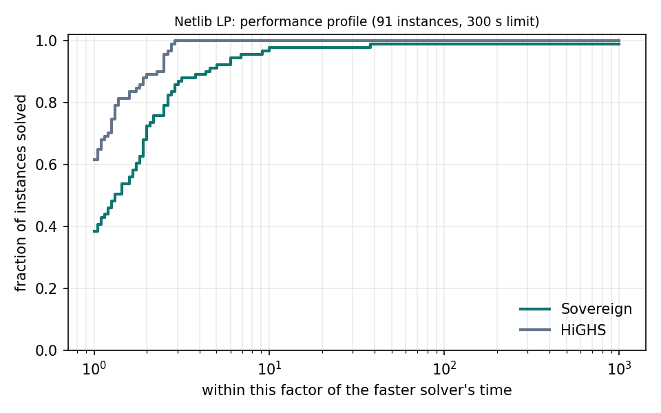
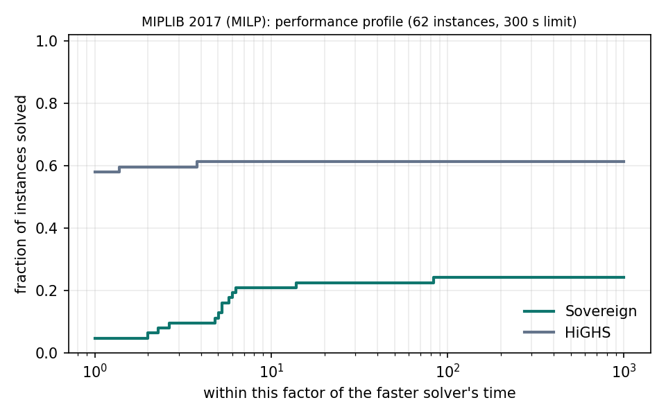
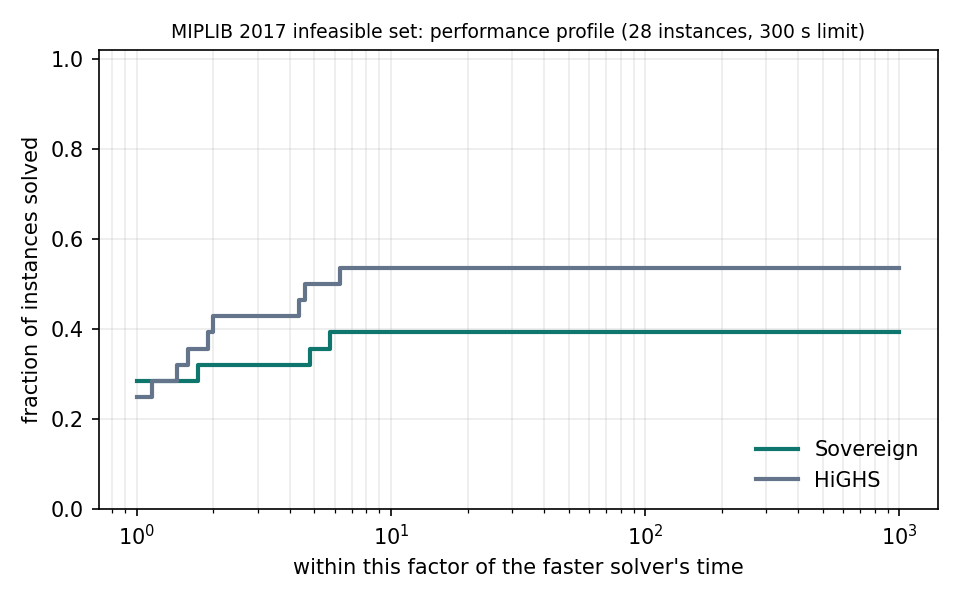
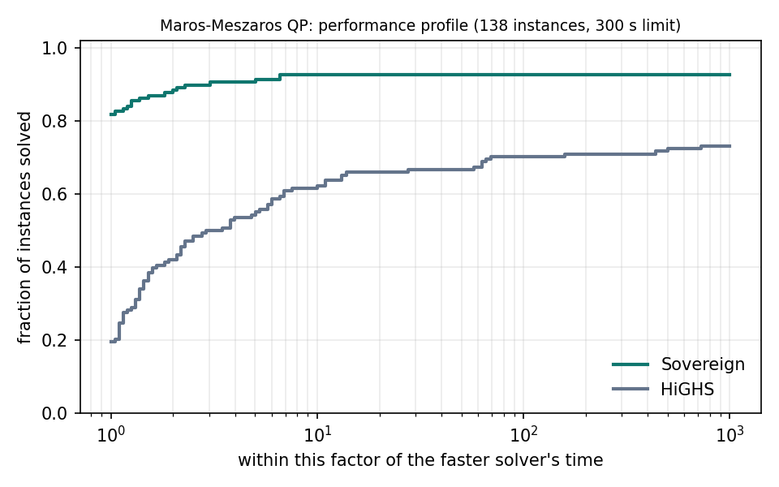

# Coverage benchmark: Sovereign vs HiGHS

Generated by `benchmarks/runners/run_coverage.py`. Inputs are fetched unmodified by
`benchmarks/tools/fetch_coverage_corpus.py`; `datasets/coverage/corpus.json` pins their sha256.

**Protocol.** Same input file for both solvers, one thread each, same wall-clock limit, each
solver pinned to its own performance core and run side by side. MILP relative gap 1e-6 for
both. Times are solve times (presolve included, file reading excluded); quick solved runs are
timed up to 3 times and the median kept. For QP, HiGHS' `qp_nullspace_limit` is raised from its
default 4000 to the number of variables; otherwise its active-set solver declines large models.

**Scoring.** SOLVED means: claimed optimal (or infeasible, for the infeasible set), the returned
point passes an independent check (bounds within 1e-6 of 1 + |bound|, rows within 1e-6 of
1 + max(|rhs|, sum |a_ij x_j|) as in OSQP's relative criterion, integrality 1e-5), and its
recomputed objective matches the published optimum (Netlib readme 1e-5, MIPLIB 2017 solu 1e-4,
Maros-Meszaros 00README.QP 1e-5). Where both solvers' verified points agree and beat the published
value, or one solver's point beats it while feasible to 1e-9 on every row and bound, it is disproved
and the best such objective is used instead (listed per suite). WRONG means
a claim that failed these checks. TIMEOUT counts as the time limit in the shifted geometric mean.
Sovereign's branch-and-bound node limit is lifted so both MILP solvers stop only at the time limit;
HiGHS's `large_matrix_value` is raised to 1e30 so it accepts every model's coefficients.

## Summary

| Suite | Instances | Sovereign solved | HiGHS solved | Sovereign wrong | HiGHS wrong | SGM time Sovereign | SGM time HiGHS |
|---|---:|---:|---:|---:|---:|---:|---:|
| Netlib LP | 91 | 90 | 91 | 0 | 0 | 0.329 s | 0.134 s |
| MIPLIB 2017 (MILP) | 62 | 15 | 38 | 0 | 1 | 174.7 s | 65.7 s |
| MIPLIB 2017 infeasible set | 28 | 11 | 15 | 0 | 0 | 71.1 s | 49.6 s |
| Maros-Meszaros QP | 138 | 128 | 105 | 0 | 2 | 0.886 s | 5.508 s |

## Netlib LP

Time limit 300 s, SGM shift 1 s. Machine: 12th Gen Intel(R) Core(TM) i5-12450H, Windows-10-10.0.26200-SP0, HiGHS 1.15.1.

| | Sovereign | HiGHS |
|---|---:|---:|
| Solved | 90 | 91 |
| Wrong | 0 | 0 |
| Timeout | 1 | 0 |
| Failed | 0 | 0 |
| Shifted geometric mean, all instances (s) | 0.329 | 0.134 |
| Shifted geometric mean, 90 solved by both (s) | 0.252 | 0.102 |
| Solved only by this solver | 0 | 1 |
| Faster by >10% (of 26 both-solved instances taking ≥0.1 s) | 1 | 24 |

### Degenerate and numerically hard Netlib models

| Instance | Rows×Cols | Sovereign | HiGHS |
|---|---|---|---|
| cycle | 1903×2857 | SOLVED 0.110 | SOLVED 0.277 |
| d2q06c | 2171×5167 | SOLVED 2.387 | SOLVED 1.124 |
| degen2 | 444×534 | SOLVED 0.028 | SOLVED 0.017 |
| degen3 | 1503×1818 | SOLVED 0.539 | SOLVED 0.208 |
| dfl001 | 6071×12230 | SOLVED 89.2 | SOLVED 9.079 |
| greenbea | 2392×5405 | SOLVED 1.326 | SOLVED 0.272 |
| greenbeb | 2392×5405 | SOLVED 2.762 | SOLVED 0.474 |
| perold | 625×1376 | SOLVED 0.115 | SOLVED 0.069 |
| pilot | 1441×3652 | SOLVED 4.736 | SOLVED 1.107 |
| pilot4 | 410×1000 | SOLVED 0.069 | SOLVED 0.032 |
| pilot87 | 2030×4883 | TIMEOUT 300.0 | SOLVED 14.0 |
| pilotnov | 975×2172 | SOLVED 0.290 | SOLVED 0.314 |
| stair | 356×467 | SOLVED 0.026 | SOLVED 0.032 |

### Published optima disproved by a verified point

Either both solvers returned verified points that agree and beat the published value, or the
listed solver's point beat it while feasible to 1e-9 on every row and bound. These instances
were scored against the best such objective.

| Instance | Published | Best verified | Found by |
|---|---:|---:|---|
| greenbea | -72462405.91 | -72555248.13 | HiGHS, Sovereign |
| greenbeb | -4302147.606 | -4302260.261 | HiGHS, Sovereign |
| pilot | -557.4043001 | -557.4897293 | HiGHS, Sovereign |

All instances

| Instance | Rows×Cols | Sovereign | HiGHS |
|---|---|---|---|
| 25fv47 | 821×1571 | SOLVED 0.264 | SOLVED 0.169 |
| 80bau3b | 2262×9799 | SOLVED 0.842 | SOLVED 0.140 |
| adlittle | 56×97 | SOLVED 0.001 | SOLVED 0.002 |
| afiro | 27×32 | SOLVED 0.000 | SOLVED 0.001 |
| agg | 488×163 | SOLVED 0.008 | SOLVED 0.004 |
| agg2 | 516×302 | SOLVED 0.012 | SOLVED 0.006 |
| agg3 | 516×302 | SOLVED 0.012 | SOLVED 0.006 |
| bandm | 305×472 | SOLVED 0.010 | SOLVED 0.011 |
| beaconfd | 173×262 | SOLVED 0.005 | SOLVED 0.004 |
| blend | 74×83 | SOLVED 0.001 | SOLVED 0.003 |
| bnl1 | 643×1175 | SOLVED 0.058 | SOLVED 0.029 |
| bnl2 | 2324×3489 | SOLVED 0.179 | SOLVED 0.073 |
| boeing1 | 351×384 | SOLVED 0.023 | SOLVED 0.023 |
| boeing2 | 166×143 | SOLVED 0.003 | SOLVED 0.007 |
| bore3d | 233×315 | SOLVED 0.003 | SOLVED 0.003 |
| brandy | 220×249 | SOLVED 0.005 | SOLVED 0.006 |
| capri | 271×353 | SOLVED 0.006 | SOLVED 0.005 |
| cycle | 1903×2857 | SOLVED 0.110 | SOLVED 0.277 |
| czprob | 929×3523 | SOLVED 0.097 | SOLVED 0.034 |
| d2q06c | 2171×5167 | SOLVED 2.387 | SOLVED 1.124 |
| d6cube | 415×6184 | SOLVED 0.148 | SOLVED 0.127 |
| degen2 | 444×534 | SOLVED 0.028 | SOLVED 0.017 |
| degen3 | 1503×1818 | SOLVED 0.539 | SOLVED 0.208 |
| dfl001 | 6071×12230 | SOLVED 89.2 | SOLVED 9.079 |
| e226 | 223×282 | SOLVED 0.008 | SOLVED 0.009 |
| etamacro | 400×688 | SOLVED 0.018 | SOLVED 0.013 |
| fffff800 | 524×854 | SOLVED 0.025 | SOLVED 0.013 |
| finnis | 497×614 | SOLVED 0.025 | SOLVED 0.007 |
| fit1d | 24×1026 | SOLVED 0.025 | SOLVED 0.013 |
| fit1p | 627×1677 | SOLVED 0.050 | SOLVED 0.041 |
| fit2d | 25×10500 | SOLVED 1.447 | SOLVED 0.164 |
| fit2p | 3000×13525 | SOLVED 2.973 | SOLVED 1.073 |
| forplan | 161×421 | SOLVED 0.007 | SOLVED 0.008 |
| ganges | 1309×1681 | SOLVED 0.042 | SOLVED 0.016 |
| gfrd-pnc | 616×1092 | SOLVED 0.016 | SOLVED 0.009 |
| greenbea | 2392×5405 | SOLVED 1.326 | SOLVED 0.272 |
| greenbeb | 2392×5405 | SOLVED 2.762 | SOLVED 0.474 |
| grow15 | 300×645 | SOLVED 0.025 | SOLVED 0.042 |
| grow22 | 440×946 | SOLVED 0.115 | SOLVED 0.088 |
| grow7 | 140×301 | SOLVED 0.005 | SOLVED 0.012 |
| israel | 174×142 | SOLVED 0.004 | SOLVED 0.005 |
| kb2 | 43×41 | SOLVED 0.001 | SOLVED 0.002 |
| lotfi | 153×308 | SOLVED 0.004 | SOLVED 0.003 |
| maros | 846×1443 | SOLVED 0.138 | SOLVED 0.047 |
| maros-r7 | 3136×9408 | SOLVED 28.3 | SOLVED 0.752 |
| modszk1 | 687×1620 | SOLVED 0.024 | SOLVED 0.017 |
| nesm | 662×2923 | SOLVED 0.235 | SOLVED 0.167 |
| perold | 625×1376 | SOLVED 0.115 | SOLVED 0.069 |
| pilot | 1441×3652 | SOLVED 4.736 | SOLVED 1.107 |
| pilot4 | 410×1000 | SOLVED 0.069 | SOLVED 0.032 |
| pilot87 | 2030×4883 | TIMEOUT 300.0 | SOLVED 14.0 |
| pilotnov | 975×2172 | SOLVED 0.290 | SOLVED 0.314 |
| recipe | 91×180 | SOLVED 0.002 | SOLVED 0.005 |
| sc105 | 105×103 | SOLVED 0.001 | SOLVED 0.004 |
| sc205 | 205×203 | SOLVED 0.004 | SOLVED 0.005 |
| sc50a | 50×48 | SOLVED 0.001 | SOLVED 0.003 |
| sc50b | 50×48 | SOLVED 0.001 | SOLVED 0.003 |
| scagr25 | 471×500 | SOLVED 0.015 | SOLVED 0.013 |
| scagr7 | 129×140 | SOLVED 0.002 | SOLVED 0.005 |
| scfxm1 | 330×457 | SOLVED 0.013 | SOLVED 0.017 |
| scfxm2 | 660×914 | SOLVED 0.048 | SOLVED 0.040 |
| scfxm3 | 990×1371 | SOLVED 0.114 | SOLVED 0.055 |
| scorpion | 388×358 | SOLVED 0.006 | SOLVED 0.008 |
| scrs8 | 490×1169 | SOLVED 0.055 | SOLVED 0.028 |
| scsd1 | 77×760 | SOLVED 0.005 | SOLVED 0.005 |
| scsd6 | 147×1350 | SOLVED 0.014 | SOLVED 0.013 |
| scsd8 | 397×2750 | SOLVED 0.079 | SOLVED 0.062 |
| sctap1 | 300×480 | SOLVED 0.009 | SOLVED 0.011 |
| sctap2 | 1090×1880 | SOLVED 0.060 | SOLVED 0.025 |
| sctap3 | 1480×2480 | SOLVED 0.109 | SOLVED 0.035 |
| seba | 515×1028 | SOLVED 0.021 | SOLVED 0.012 |
| share1b | 117×225 | SOLVED 0.004 | SOLVED 0.007 |
| share2b | 96×79 | SOLVED 0.002 | SOLVED 0.005 |
| shell | 536×1775 | SOLVED 0.022 | SOLVED 0.028 |
| ship04l | 402×2118 | SOLVED 0.064 | SOLVED 0.035 |
| ship04s | 402×1458 | SOLVED 0.044 | SOLVED 0.018 |
| ship08l | 778×4283 | SOLVED 0.150 | SOLVED 0.034 |
| ship08s | 778×2387 | SOLVED 0.033 | SOLVED 0.022 |
| ship12l | 1151×5427 | SOLVED 0.120 | SOLVED 0.044 |
| ship12s | 1151×2763 | SOLVED 0.036 | SOLVED 0.019 |
| sierra | 1227×2036 | SOLVED 0.042 | SOLVED 0.025 |
| stair | 356×467 | SOLVED 0.026 | SOLVED 0.032 |
| standata | 359×1075 | SOLVED 0.007 | SOLVED 0.010 |
| standgub | 361×1184 | SOLVED 0.010 | SOLVED 0.010 |
| standmps | 467×1075 | SOLVED 0.010 | SOLVED 0.010 |
| stocfor1 | 117×111 | SOLVED 0.002 | SOLVED 0.003 |
| stocfor2 | 2157×2031 | SOLVED 0.316 | SOLVED 0.046 |
| tuff | 333×587 | SOLVED 0.010 | SOLVED 0.012 |
| vtpbase | 198×203 | SOLVED 0.002 | SOLVED 0.003 |
| wood1p | 244×2594 | SOLVED 0.173 | SOLVED 0.107 |
| woodw | 1098×8405 | SOLVED 0.312 | SOLVED 0.121 |

## MIPLIB 2017 (MILP)

Time limit 300 s, SGM shift 10 s. Machine: 12th Gen Intel(R) Core(TM) i5-12450H, Windows-10-10.0.26200-SP0, HiGHS 1.15.1.

| | Sovereign | HiGHS |
|---|---:|---:|
| Solved | 15 | 38 |
| Wrong | 0 | 1 |
| Timeout | 47 | 23 |
| Failed | 0 | 0 |
| Shifted geometric mean, all instances (s) | 174.7 | 65.7 |
| Shifted geometric mean, 14 solved by both (s) | 21.4 | 7.099 |
| Solved only by this solver | 1 | 24 |
| Faster by >10% (of 14 both-solved instances taking ≥0.1 s) | 2 | 12 |

All instances

| Instance | Rows×Cols | Sovereign | HiGHS |
|---|---|---|---|
| 10teams | 230×2025 | TIMEOUT 300.2 | SOLVED 1.870 |
| 50v-10 | 233×2013 | TIMEOUT 300.1 | TIMEOUT 300.1 |
| air03 | 124×10757 | SOLVED 1.445 | SOLVED 5.427 |
| air04 | 823×8904 | TIMEOUT 301.2 | SOLVED 81.3 |
| air05 | 426×7195 | SOLVED 253.0 | SOLVED 42.9 |
| assign1-5-8 | 161×156 | TIMEOUT 300.4 | TIMEOUT 300.1 |
| b-ball | 30×100 | TIMEOUT 301.1 | SOLVED 0.292 |
| beasleyC3 | 1750×2500 | TIMEOUT 300.0 | SOLVED 42.1 |
| binkar10_1 | 1026×2298 | TIMEOUT 300.9 | WRONG |
| blend2 | 274×353 | SOLVED 11.6 | SOLVED 2.289 |
| cap6000 | 2176×6000 | TIMEOUT 300.1 | SOLVED 3.597 |
| danoint | 664×521 | TIMEOUT 300.0 | TIMEOUT 300.0 |
| dcmulti | 290×548 | SOLVED 3.563 | SOLVED 1.361 |
| eil33-2 | 32×4516 | TIMEOUT 300.0 | SOLVED 87.3 |
| enlight_hard | 100×200 | TIMEOUT 300.1 | SOLVED 18.2 |
| exp-1-500-5-5 | 550×990 | TIMEOUT 300.1 | SOLVED 3.811 |
| fiber | 363×1298 | SOLVED 5.634 | SOLVED 0.995 |
| flugpl | 18×18 | SOLVED 0.084 | SOLVED 0.112 |
| gen-ip002 | 24×41 | TIMEOUT 300.2 | TIMEOUT 300.0 |
| gen-ip016 | 24×28 | TIMEOUT 300.4 | TIMEOUT 300.0 |
| gen-ip021 | 28×35 | TIMEOUT 300.2 | TIMEOUT 300.0 |
| gen-ip036 | 46×29 | TIMEOUT 300.1 | TIMEOUT 300.0 |
| gen-ip054 | 27×30 | TIMEOUT 300.4 | TIMEOUT 300.0 |
| glass4 | 396×322 | TIMEOUT 300.1 | TIMEOUT 300.0 |
| gmu-35-40 | 424×1205 | TIMEOUT 300.0 | TIMEOUT 300.0 |
| gt2 | 29×188 | SOLVED 0.333 | SOLVED 0.067 |
| khb05250 | 101×1350 | SOLVED 5.833 | SOLVED 0.439 |
| lotsize | 1920×2985 | TIMEOUT 300.0 | TIMEOUT 300.0 |
| markshare_4_0 | 4×34 | TIMEOUT 300.1 | SOLVED 262.2 |
| markshare_5_0 | 5×45 | TIMEOUT 300.1 | TIMEOUT 300.0 |
| mas74 | 13×151 | TIMEOUT 300.2 | TIMEOUT 300.0 |
| mas76 | 12×151 | TIMEOUT 300.0 | SOLVED 122.6 |
| mcsched | 2107×1747 | TIMEOUT 300.1 | TIMEOUT 300.0 |
| mik-250-20-75-4 | 195×270 | TIMEOUT 300.0 | SOLVED 24.2 |
| misc07 | 212×260 | SOLVED 208.8 | SOLVED 45.5 |
| mod010 | 146×2655 | SOLVED 3.673 | SOLVED 0.705 |
| mod011 | 4480×10958 | TIMEOUT 300.1 | SOLVED 89.3 |
| neos-2657525-crna | 342×524 | TIMEOUT 302.3 | TIMEOUT 300.0 |
| neos-3754480-nidda | 402×253 | TIMEOUT 300.1 | TIMEOUT 300.0 |
| neos-911970 | 107×888 | TIMEOUT 300.1 | SOLVED 38.6 |
| neos17 | 486×535 | TIMEOUT 300.0 | SOLVED 12.7 |
| neos5 | 63×63 | TIMEOUT 300.2 | SOLVED 163.2 |
| noswot | 182×128 | TIMEOUT 300.3 | SOLVED 208.8 |
| p0201 | 133×201 | SOLVED 2.142 | SOLVED 0.974 |
| p200x1188c | 1388×2376 | TIMEOUT 300.0 | SOLVED 1.264 |
| pg | 125×2700 | TIMEOUT 300.0 | SOLVED 8.060 |
| pg5_34 | 225×2600 | TIMEOUT 300.0 | TIMEOUT 300.0 |
| pk1 | 45×86 | SOLVED 286.8 | TIMEOUT 300.0 |
| qiu | 1192×840 | SOLVED 183.4 | SOLVED 93.0 |
| qnet1 | 503×1541 | TIMEOUT 300.3 | SOLVED 0.951 |
| qnet1_o | 456×1541 | SOLVED 77.0 | SOLVED 0.928 |
| r50x360 | 410×720 | TIMEOUT 300.1 | SOLVED 71.4 |
| ran14x18-disj-8 | 447×504 | TIMEOUT 300.1 | TIMEOUT 300.0 |
| rentacar | 6803×9557 | SOLVED 54.0 | SOLVED 8.690 |
| roll3000 | 2295×1166 | TIMEOUT 300.1 | SOLVED 63.1 |
| rout | 291×556 | TIMEOUT 300.1 | SOLVED 37.6 |
| sp150x300d | 450×600 | TIMEOUT 300.0 | SOLVED 0.096 |
| supportcase26 | 870×436 | TIMEOUT 300.1 | TIMEOUT 300.0 |
| swath | 884×6805 | TIMEOUT 300.1 | TIMEOUT 300.1 |
| tr12-30 | 750×1080 | TIMEOUT 300.0 | TIMEOUT 300.0 |
| uct-subprob | 1973×2256 | TIMEOUT 300.0 | TIMEOUT 300.0 |
| unitcal_7 | 48939×25755 | TIMEOUT 308.6 | SOLVED 273.7 |

## MIPLIB 2017 infeasible set

Time limit 300 s, SGM shift 10 s. Machine: 12th Gen Intel(R) Core(TM) i5-12450H, Windows-10-10.0.26200-SP0, HiGHS 1.15.1.

| | Sovereign | HiGHS |
|---|---:|---:|
| Solved | 11 | 15 |
| Wrong | 0 | 0 |
| Timeout | 16 | 13 |
| Failed | 1 | 0 |
| Shifted geometric mean, all instances (s) | 71.1 | 49.6 |
| Shifted geometric mean, 11 solved by both (s) | 0.200 | 0.331 |
| Solved only by this solver | 0 | 4 |
| Faster by >10% (of 6 both-solved instances taking ≥0.1 s) | 4 | 2 |

All instances

| Instance | Rows×Cols | Sovereign | HiGHS |
|---|---|---|---|
| bnatt500 | 7029×4500 | TIMEOUT 301.0 | TIMEOUT 300.0 |
| control30-5-10-4 | 3640×1960 | FAILED | TIMEOUT 300.1 |
| dell | 500×626 | SOLVED 0.193 | SOLVED 0.041 |
| enlight11 | 121×242 | TIMEOUT 300.1 | SOLVED 92.7 |
| enlight4 | 16×32 | SOLVED 0.079 | SOLVED 0.153 |
| enlight9 | 81×162 | TIMEOUT 300.1 | SOLVED 12.6 |
| fhnw-binpack4-18 | 650×520 | TIMEOUT 300.1 | TIMEOUT 300.0 |
| fhnw-binpack4-4 | 620×520 | TIMEOUT 300.1 | TIMEOUT 300.0 |
| fhnw-sq3 | 167×2450 | TIMEOUT 300.0 | TIMEOUT 300.0 |
| flugplinf | 19×18 | SOLVED 0.084 | SOLVED 0.049 |
| g503inf | 41×48 | SOLVED 0.001 | SOLVED 0.002 |
| misc04inf | 1726×4897 | SOLVED 0.431 | SOLVED 0.618 |
| misc05inf | 301×136 | SOLVED 0.273 | SOLVED 0.048 |
| mod008inf | 7×319 | SOLVED 0.039 | SOLVED 0.073 |
| neos-2626858-aoos | 342×524 | TIMEOUT 300.0 | TIMEOUT 300.0 |
| neos-2656603-coxs | 342×524 | TIMEOUT 303.7 | SOLVED 53.0 |
| neos-3135526-osun | 1546×192 | TIMEOUT 300.0 | SOLVED 0.088 |
| neos-3211096-shag | 10187×4379 | TIMEOUT 300.4 | TIMEOUT 300.0 |
| neos-4382714-ruvuma | 3645×6562 | TIMEOUT 300.0 | TIMEOUT 300.0 |
| neos859080 | 164×160 | SOLVED 0.347 | SOLVED 1.514 |
| no-ip-64999 | 2547×2232 | TIMEOUT 300.0 | TIMEOUT 300.0 |
| no-ip-65059 | 2547×2232 | TIMEOUT 300.1 | TIMEOUT 300.0 |
| p2m2p1m1p0n100 | 1×100 | TIMEOUT 300.1 | TIMEOUT 300.0 |
| ponderthis0517-inf | 78×975 | TIMEOUT 300.0 | TIMEOUT 300.0 |
| pythago7825 | 14672×3745 | TIMEOUT 300.0 | TIMEOUT 300.0 |
| stein15inf | 37×15 | SOLVED 0.015 | SOLVED 0.096 |
| stein45inf | 332×45 | SOLVED 0.764 | SOLVED 1.163 |
| stein9inf | 14×9 | SOLVED 0.003 | SOLVED 0.015 |

## Maros-Meszaros QP

Time limit 300 s, SGM shift 1 s. Machine: 12th Gen Intel(R) Core(TM) i5-12450H, Windows-10-10.0.26200-SP0, HiGHS 1.15.1.

| | Sovereign | HiGHS |
|---|---:|---:|
| Solved | 128 | 105 |
| Wrong | 0 | 2 |
| Timeout | 2 | 22 |
| Failed | 8 | 9 |
| Shifted geometric mean, all instances (s) | 0.886 | 5.508 |
| Shifted geometric mean, 95 solved by both (s) | 0.138 | 0.818 |
| Solved only by this solver | 33 | 10 |
| Faster by >10% (of 35 both-solved instances taking ≥0.1 s) | 31 | 3 |

### Published optima disproved by a verified point

Either both solvers returned verified points that agree and beat the published value, or the
listed solver's point beat it while feasible to 1e-9 on every row and bound. These instances
were scored against the best such objective.

| Instance | Published | Best verified | Found by |
|---|---:|---:|---|
| LISWET8 | 7144.7006 | 714.470059 | HiGHS |

### HiGHS misses re-run from the original QPS files

HiGHS here receives the same model as Sovereign, converted from the Maros-Meszaros MAT files.
To rule out the conversion, `benchmarks/tools/highs_qps_crosscheck.py` re-ran every instance
HiGHS did not solve with HiGHS reading the original QPS file itself (`readModel`, default
options, one thread, 300 s). With the
default `qp_nullspace_limit` some large models stop at once with a solve error instead of
running to the time limit.

| Instance | Harness outcome | HiGHS on QPS file | Objective | Published |
|---|---|---|---:|---:|
| AUG2D | TIMEOUT | Solve error |  | 1687411.8 |
| AUG2DC | TIMEOUT | Solve error |  | 1818368.1 |
| AUG2DCQP | TIMEOUT | Time limit reached | 46193994.71 | 6498134.8 |
| AUG2DQP | TIMEOUT | Time limit reached | 55293229.61 | 6237012.1 |
| BOYD1 | TIMEOUT | Time limit reached | 8.250929408e+11 | -61735220.0 |
| BOYD2 | TIMEOUT | Time limit reached | 24215.83014 | 21.256767 |
| CONT-101 | TIMEOUT | Time limit reached | 0.3271809648 | 0.19552733 |
| CONT-200 | TIMEOUT | Time limit reached | 0 | -4.6848759 |
| CONT-201 | TIMEOUT | Time limit reached | 0 | 0.19248337 |
| CONT-300 | TIMEOUT | Time limit reached | 0 | 0.19151232 |
| DTOC3 | TIMEOUT | Solve error |  | 235.26248 |
| HUES-MOD | TIMEOUT | Time limit reached | 54089420.77 | 34824690.0 |
| HUESTIS | TIMEOUT | Time limit reached | 6.228076713e+11 | 348246900000.0 |
| KSIP | FAILED | Not Set |  | 0.57579794 |
| LASER | FAILED | Not Set |  | 2409601.4 |
| MOSARQP1 | FAILED | Solve error |  | -952.87544 |
| MOSARQP2 | TIMEOUT | Time limit reached | -1439.019612 | -1597.4821 |
| Q25FV47 | TIMEOUT | Time limit reached | 41699767.82 | 13744448.0 |
| QBORE3D | WRONG | Optimal | 3102.138797 | 3100.2008 |
| QCAPRI | FAILED | Solve error |  | 66793293.0 |
| QE226 | FAILED | Not Set |  | 212.65343 |
| QGROW15 | TIMEOUT | Solve error |  | -101693640.0 |
| QGROW22 | TIMEOUT | Time limit reached | -20673517.95 | -149628950.0 |
| QGROW7 | TIMEOUT | Time limit reached | -42061497.68 | -42798714.0 |
| QPCSTAIR | TIMEOUT | Not Set |  | 6204387.5 |
| QPILOTNO | FAILED | Not Set |  | 4728586.9 |
| QSCTAP2 | FAILED | Not Set |  | 1735.0265 |
| QSCTAP3 | FAILED | Not Set |  | 1438.7547 |
| QSHARE1B | WRONG | Solve error |  | 720078.32 |
| QSIERRA | FAILED | Solve error |  | 23750458.0 |
| QSTAIR | TIMEOUT | Time limit reached | 7985452.754 | 7985452.8 |
| STADAT3 | TIMEOUT | Solve error |  | -35.779453 |
| UBH1 | TIMEOUT | Time limit reached | 1032.898558 | 1.1160008 |

All instances

| Instance | Rows×Cols | Sovereign | HiGHS |
|---|---|---|---|
| AUG2D | 10000×20200 | SOLVED 0.141 | TIMEOUT 300.0 |
| AUG2DC | 10000×20200 | SOLVED 0.102 | TIMEOUT 300.0 |
| AUG2DCQP | 10000×20200 | SOLVED 0.222 | TIMEOUT 300.1 |
| AUG2DQP | 10000×20200 | SOLVED 0.242 | TIMEOUT 300.0 |
| AUG3D | 1000×3873 | SOLVED 0.021 | SOLVED 32.4 |
| AUG3DC | 1000×3873 | SOLVED 0.021 | SOLVED 32.0 |
| AUG3DCQP | 1000×3873 | SOLVED 0.057 | SOLVED 141.9 |
| AUG3DQP | 1000×3873 | SOLVED 0.050 | SOLVED 35.7 |
| BOYD1 | 18×93261 | SOLVED 2.489 | TIMEOUT 300.1 |
| BOYD2 | 186531×93263 | SOLVED 13.2 | TIMEOUT 331.2 |
| CONT-050 | 2401×2597 | SOLVED 0.148 | SOLVED 1.620 |
| CONT-100 | 9801×10197 | SOLVED 0.915 | SOLVED 55.6 |
| CONT-101 | 10098×10197 | SOLVED 0.912 | TIMEOUT 310.3 |
| CONT-200 | 39601×40397 | SOLVED 13.9 | TIMEOUT 303.2 |
| CONT-201 | 40198×40397 | SOLVED 32.0 | TIMEOUT 300.3 |
| CONT-300 | 90298×90597 | SOLVED 197.5 | TIMEOUT 300.3 |
| CVXQP1_L | 5000×10000 | TIMEOUT 300.0 | SOLVED 31.2 |
| CVXQP1_M | 500×1000 | SOLVED 0.096 | SOLVED 0.086 |
| CVXQP1_S | 50×100 | SOLVED 0.002 | SOLVED 0.002 |
| CVXQP2_L | 2500×10000 | SOLVED 79.8 | SOLVED 298.7 |
| CVXQP2_M | 250×1000 | SOLVED 0.065 | SOLVED 0.071 |
| CVXQP2_S | 25×100 | SOLVED 0.001 | SOLVED 0.003 |
| CVXQP3_L | 7500×10000 | TIMEOUT 300.0 | SOLVED 53.1 |
| CVXQP3_M | 750×1000 | SOLVED 0.151 | SOLVED 0.159 |
| CVXQP3_S | 75×100 | SOLVED 0.002 | SOLVED 0.003 |
| DPKLO1 | 77×133 | SOLVED 0.002 | SOLVED 0.004 |
| DTOC3 | 9998×14999 | SOLVED 0.086 | TIMEOUT 350.9 |
| DUAL1 | 1×85 | SOLVED 0.005 | SOLVED 0.006 |
| DUAL2 | 1×96 | SOLVED 0.012 | SOLVED 0.004 |
| DUAL3 | 1×111 | SOLVED 0.010 | SOLVED 0.005 |
| DUAL4 | 1×75 | SOLVED 0.005 | SOLVED 0.003 |
| DUALC1 | 215×9 | SOLVED 0.002 | SOLVED 0.002 |
| DUALC2 | 229×7 | SOLVED 0.002 | SOLVED 0.002 |
| DUALC5 | 278×8 | SOLVED 0.003 | SOLVED 0.004 |
| DUALC8 | 503×8 | SOLVED 0.005 | SOLVED 0.003 |
| EXDATA | 3001×3000 | SOLVED 27.6 | SOLVED 5.697 |
| GENHS28 | 8×10 | SOLVED 0.000 | SOLVED 0.001 |
| GOULDQP2 | 349×699 | SOLVED 0.008 | SOLVED 0.203 |
| GOULDQP3 | 349×699 | SOLVED 0.007 | SOLVED 0.053 |
| HS118 | 17×15 | SOLVED 0.004 | SOLVED 0.002 |
| HS21 | 1×2 | SOLVED 0.001 | SOLVED 0.002 |
| HS268 | 5×5 | SOLVED 0.001 | SOLVED 0.001 |
| HS35 | 1×3 | SOLVED 0.001 | SOLVED 0.001 |
| HS35MOD | 1×3 | SOLVED 0.001 | SOLVED 0.002 |
| HS51 | 3×5 | SOLVED 0.000 | SOLVED 0.002 |
| HS52 | 3×5 | SOLVED 0.000 | SOLVED 0.001 |
| HS53 | 3×5 | SOLVED 0.000 | SOLVED 0.002 |
| HS76 | 3×4 | SOLVED 0.000 | SOLVED 0.002 |
| HUES-MOD | 2×10000 | SOLVED 0.062 | TIMEOUT 300.1 |
| HUESTIS | 2×10000 | SOLVED 0.044 | TIMEOUT 300.2 |
| KSIP | 1000×20 | SOLVED 0.020 | FAILED |
| LASER | 1000×1002 | SOLVED 0.020 | FAILED |
| LISWET1 | 10000×10002 | FAILED | SOLVED 1.096 |
| LISWET10 | 10000×10002 | FAILED | SOLVED 1.381 |
| LISWET11 | 10000×10002 | FAILED | SOLVED 1.694 |
| LISWET12 | 10000×10002 | FAILED | SOLVED 1.147 |
| LISWET2 | 10000×10002 | SOLVED 0.153 | SOLVED 1.037 |
| LISWET3 | 10000×10002 | SOLVED 0.164 | SOLVED 2.112 |
| LISWET4 | 10000×10002 | SOLVED 0.197 | SOLVED 2.101 |
| LISWET5 | 10000×10002 | SOLVED 0.144 | SOLVED 8.102 |
| LISWET6 | 10000×10002 | SOLVED 0.337 | SOLVED 4.625 |
| LISWET7 | 10000×10002 | FAILED | SOLVED 1.244 |
| LISWET8 | 10000×10002 | FAILED | SOLVED 1.265 |
| LISWET9 | 10000×10002 | FAILED | SOLVED 1.202 |
| LOTSCHD | 7×12 | SOLVED 0.000 | SOLVED 0.001 |
| MOSARQP1 | 700×2500 | SOLVED 0.023 | FAILED |
| MOSARQP2 | 600×900 | SOLVED 0.014 | TIMEOUT 300.0 |
| POWELL20 | 10000×10000 | SOLVED 0.288 | SOLVED 0.707 |
| PRIMAL1 | 85×325 | SOLVED 0.008 | SOLVED 0.023 |
| PRIMAL2 | 96×649 | SOLVED 0.011 | SOLVED 0.057 |
| PRIMAL3 | 111×745 | SOLVED 0.028 | SOLVED 0.178 |
| PRIMAL4 | 75×1489 | SOLVED 0.020 | SOLVED 1.309 |
| PRIMALC1 | 9×230 | SOLVED 0.003 | SOLVED 0.003 |
| PRIMALC2 | 7×231 | SOLVED 0.002 | SOLVED 0.002 |
| PRIMALC5 | 8×287 | SOLVED 0.002 | SOLVED 0.003 |
| PRIMALC8 | 8×520 | SOLVED 0.005 | SOLVED 0.005 |
| Q25FV47 | 780×1571 | SOLVED 0.405 | TIMEOUT 300.0 |
| QADLITTL | 53×97 | SOLVED 0.029 | SOLVED 0.005 |
| QAFIRO | 25×32 | SOLVED 0.002 | SOLVED 0.001 |
| QBANDM | 269×472 | SOLVED 0.009 | SOLVED 0.036 |
| QBEACONF | 148×262 | SOLVED 0.006 | SOLVED 0.005 |
| QBORE3D | 197×315 | SOLVED 0.005 | WRONG |
| QBRANDY | 133×249 | SOLVED 0.006 | SOLVED 0.009 |
| QCAPRI | 266×353 | SOLVED 0.014 | FAILED |
| QE226 | 175×282 | SOLVED 0.008 | FAILED |
| QETAMACR | 400×688 | SOLVED 0.119 | SOLVED 0.062 |
| QFFFFF80 | 501×854 | SOLVED 0.057 | SOLVED 0.118 |
| QFORPLAN | 134×421 | SOLVED 0.014 | SOLVED 0.018 |
| QGFRDXPN | 600×1092 | SOLVED 0.018 | SOLVED 0.103 |
| QGROW15 | 300×645 | SOLVED 0.022 | TIMEOUT 300.0 |
| QGROW22 | 440×946 | SOLVED 0.038 | TIMEOUT 300.0 |
| QGROW7 | 140×301 | SOLVED 0.012 | TIMEOUT 300.0 |
| QISRAEL | 163×142 | SOLVED 0.008 | SOLVED 0.011 |
| QPCBLEND | 72×83 | SOLVED 0.025 | SOLVED 0.004 |
| QPCBOEI1 | 317×384 | SOLVED 0.014 | SOLVED 0.080 |
| QPCBOEI2 | 135×143 | SOLVED 0.006 | SOLVED 0.007 |
| QPCSTAIR | 356×467 | SOLVED 0.020 | TIMEOUT 300.0 |
| QPILOTNO | 973×2172 | SOLVED 0.553 | FAILED |
| QPTEST | 2×2 | SOLVED 0.000 | SOLVED 0.001 |
| QRECIPE | 91×180 | SOLVED 0.003 | SOLVED 0.005 |
| QSC205 | 203×203 | SOLVED 0.002 | SOLVED 0.004 |
| QSCAGR25 | 348×500 | SOLVED 0.005 | SOLVED 0.062 |
| QSCAGR7 | 96×140 | SOLVED 0.002 | SOLVED 0.004 |
| QSCFXM1 | 289×457 | SOLVED 0.014 | SOLVED 0.031 |
| QSCFXM2 | 578×914 | SOLVED 0.034 | SOLVED 0.115 |
| QSCFXM3 | 867×1371 | SOLVED 0.050 | SOLVED 0.241 |
| QSCORPIO | 297×358 | SOLVED 0.004 | SOLVED 0.005 |
| QSCRS8 | 483×1169 | SOLVED 0.014 | SOLVED 0.094 |
| QSCSD1 | 77×760 | SOLVED 0.005 | SOLVED 0.019 |
| QSCSD6 | 147×1350 | SOLVED 0.018 | SOLVED 0.179 |
| QSCSD8 | 397×2750 | SOLVED 0.021 | SOLVED 1.254 |
| QSCTAP1 | 300×480 | SOLVED 0.005 | SOLVED 0.304 |
| QSCTAP2 | 1090×1880 | SOLVED 0.034 | FAILED |
| QSCTAP3 | 1480×2480 | SOLVED 0.034 | FAILED |
| QSEBA | 515×1028 | SOLVED 0.019 | SOLVED 0.019 |
| QSHARE1B | 112×225 | SOLVED 0.004 | WRONG |
| QSHARE2B | 93×79 | SOLVED 0.002 | SOLVED 0.004 |
| QSHELL | 536×1775 | SOLVED 0.204 | SOLVED 1.156 |
| QSHIP04L | 356×2118 | SOLVED 0.014 | SOLVED 0.086 |
| QSHIP04S | 268×1458 | SOLVED 0.011 | SOLVED 0.040 |
| QSHIP08L | 688×4283 | SOLVED 0.251 | SOLVED 0.332 |
| QSHIP08S | 416×2387 | SOLVED 0.052 | SOLVED 0.111 |
| QSHIP12L | 838×5427 | SOLVED 0.525 | SOLVED 0.432 |
| QSHIP12S | 466×2763 | SOLVED 0.096 | SOLVED 0.149 |
| QSIERRA | 1227×2036 | SOLVED 0.056 | FAILED |
| QSTAIR | 356×467 | SOLVED 0.023 | TIMEOUT 300.0 |
| QSTANDAT | 355×1075 | SOLVED 0.010 | SOLVED 0.049 |
| S268 | 5×5 | SOLVED 0.000 | SOLVED 0.001 |
| STADAT1 | 3999×2001 | SOLVED 0.050 | SOLVED 24.9 |
| STADAT2 | 3999×2001 | SOLVED 0.057 | SOLVED 23.9 |
| STADAT3 | 7999×4001 | SOLVED 0.113 | TIMEOUT 300.0 |
| STCQP1 | 1881×4097 | SOLVED 0.147 | SOLVED 162.6 |
| STCQP2 | 1881×4097 | SOLVED 0.286 | SOLVED 45.1 |
| TAME | 1×2 | SOLVED 0.000 | SOLVED 0.001 |
| UBH1 | 12000×18009 | SOLVED 0.131 | TIMEOUT 300.2 |
| VALUES | 1×202 | SOLVED 0.005 | SOLVED 0.004 |
| YAO | 2000×2002 | FAILED | SOLVED 0.115 |
| ZECEVIC2 | 2×2 | SOLVED 0.000 | SOLVED 0.001 |

